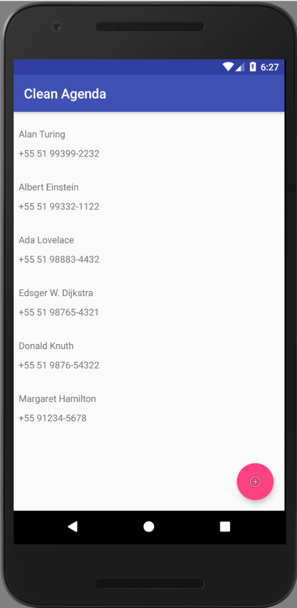
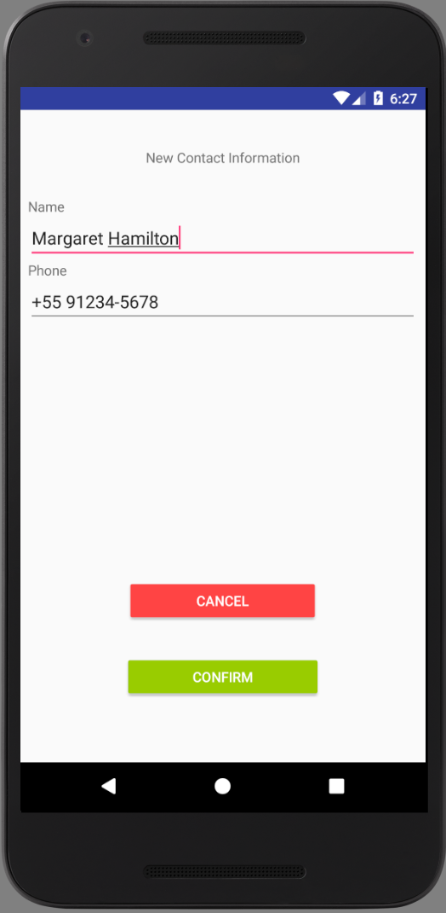

# Clean Agenda
A simple contact schedule app for Android.

  
  

<b>This app is a personal project to review and study different android development concepts, such as:</b>

* Activity.
* AlertDialog.
* Android Studio layout builder.
* Intent.
* Java syntax.
* Local persistence with SharedInstance.
* RecyclerView.

<b>Were applied the following design patterns:</b>

* Singleton.
* Observer.

I tried to separate the responsibilities, to decrease coupling, using:
* ContactsManager class to manage the model data.
* MainActivity being responsible to present the data, observing ContactsManager class. 

ContactsManager is also responsible for data persistence. I could have develop another class for that, but as it is a simple project, I've prefered to keep it this way.

About the data input formatting, this could be done with a regular expression, but I would need to verify the phone pattern formatting for the countries I would like to localize the app. As it was not the focus of this project, I did not worried about it.
